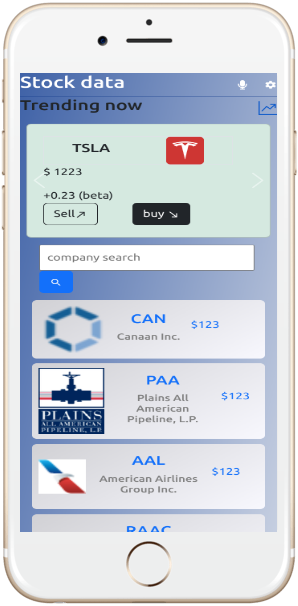
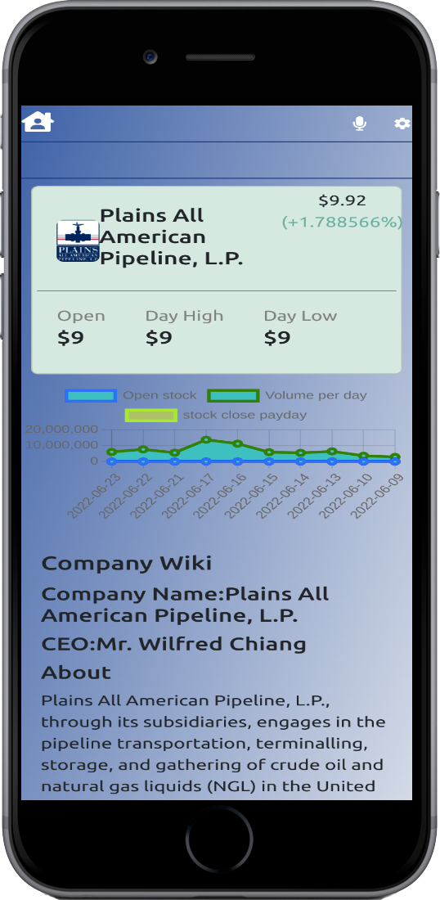

#Project: Stock Market Data
# Stock market data
> This is a javascript capstone proposed by microverse

# Table of contents
- [Overview](#overview)
  - [Built with](#built-with)
  - [Live demo](#Live-demo)
  - [Getting Started](#getting-started)
    - [Prerequisites](#prerequisites)
    - [Setup](#setup)
  - [Authors:](#authors)
    - [:man: KanoCode](#-kanocode)
    - [:handshake: Contributing](#-contributing)
    - [Show your support](#show-your-support)
    - [:memo: License](#-license)
# Overview
## Built with
- Semantic HTML5 markup
- Js
- CSS
- Webpack
- Jest
## Live demo
[](https://kanoz-accurate-stock-market-data-app.netlify.app)

## Video demo
[see my demo here](https://www.loom.com/share/f75f9c0b5de04791abc4339c2a1b2ba3)
## Screenshots


## Getting Started
> To get a local copy up and running follow these simple example steps.


### Prerequisites
- Github Account
- IDE
- Git

### Setup
- git init
- git clone [ ](https://github.com/KanoCode/Kano-Tah-Movies.git)


## Built with

- React js
- Redux
- Bootstrap
- Chart.js


## Getting Started

To get a local copy up and running follow these simple example steps.

## Setup

- Clone this repository. 
- Navigate to the project folder (Library)
- Run `npm install` command
- Run `npm start` command

## Run Tests

```
npx eslint .
```
```
npx stylelint "**/*.{css,scss}"
```

## Authors:
 **Kanombola Kanombola**

[<code></code>](https://github.com/KanoCode)
[<code></code>](https://twitter.com/Kanombola_s)
[<code></code>](https://www.linkedin.com/in/kanombola-kanombola/)
<a href="mailto:benshidanny11@gmail.com?subject=Hello Danny!"></a>


##  Contributing

Contributions, issues and feature requests are welcome!

Feel free to check the [issues page](https://github.com/benshidanny11/space-travelers/issues).

## Show your support

Give a 👍 if you like this project!

## Acknowledgments
- Original design idea by
- [Nelson Sakwa on Behance](https://www.behance.net/gallery/31579789/Ballhead-App-(Free-PSDs))

- Microverse

## 📝 License

This project is [MIT](./LICENSE.md) licensed.
